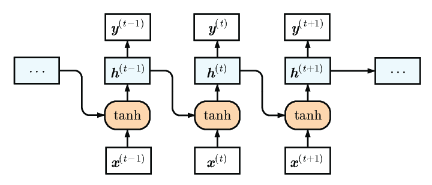

## 1. Introduction to Recurrent Neural Networks (RNNs)

Recurrent Neural Networks (RNNs) are a class of artificial neural networks designed for processing sequences of data. Unlike traditional neural networks, which assume inputs are independent of each other, RNNs leverage sequential information. This makes them particularly powerful for tasks where the order of the inputs is crucial, such as language modeling, time series prediction, speech recognition, and video analysis.


### 1.1 Key Characteristics
-----------------------------

1. **Sequential Data Handling**: RNNs are designed to work with sequential data, which means they can maintain context by storing information about previous inputs in their hidden states. This ability to remember previous inputs is what sets RNNs apart from feedforward neural networks.

2. **Recurrent Connections**: The defining feature of RNNs is their recurrent connections. These connections form cycles in the network, allowing information to persist. At each time step, the network takes an input and updates its hidden state based on both the new input and the previous hidden state.

3. **Hidden State**: The hidden state is a dynamic memory that captures information about previous time steps. At each time step $t$, the hidden state $h_t$ is updated as follows: 

   $h_t$ = $f(W_h \cdot h_{t-1} + W_x \cdot x_t + b)$

   where:
   - $h_t$ is the hidden state at time step $t$
   - $W_h$ is the weight matrix for the hidden state
   - $W_x$ is the weight matrix for the input
   - $x_t$ is the input at time step $t$
   - $b$ is the bias term
   - $f$ is the activation function (commonly tanh or ReLU)

4. **Training via Backpropagation Through Time (BPTT)**: RNNs are trained using a variant of backpropagation called Backpropagation Through Time (BPTT). In BPTT, the network is unrolled over time, and gradients are computed for each time step. These gradients are then used to update the network's weights.

<br>

 \
**Fig. Basic Princple of Recurrent Neural Network (RNN)**

<br>

**Mathemantically,** a Simple Recurrent Neural Network (RNN) is a type of neural network that maintains internal state and uses this state to process sequences of inputs. It is the simplest type of RNN and is often used as a building block for more complex RNN architectures.

### 1.2 Equations
-------------

The Simple RNN equations are as follows:

$$\begin{align}
h_t &= \sigma(W_x x_t + W_h h_{t-1} + b_h), \\
y_t &= \sigma(W_y h_t + b_y).
\end{align}$$

### 1.3 Description
--------------

The Simple RNN consists of two main components:

1.  **Hidden State**: The hidden state $h_t$ is updated at each time step $t$ based on the input $x_t$ and the previous hidden state $h_{t-1}$. This is done using the weights $W_x$ and $W_h$, and the bias $b_h$.
2.  **Output**: The output $y_t$ is computed based on the current hidden state $h_t$ and the weights $W_y$ and bias $b_y$. This output is typically used for prediction or classification.

<br>

## 2. Types of RNNs

### 2.1 Vanilla RNNs
Vanilla RNNs are the simplest form of Recurrent Neural Networks. They have a straightforward architecture where the output from the previous time step is fed back into the network as input for the next time step. This recurrence allows the network to maintain a memory of previous inputs, enabling it to handle sequential data.

Vanilla RNNs, or simple RNNs, are the foundational type of recurrent neural networks. They are called "vanilla" because they represent the basic form of RNNs without any of the modifications or improvements found in more advanced variants like LSTMs and GRUs. Vanilla RNNs process sequential data by maintaining a hidden state that is updated at each time step based on the current input and the previous hidden state. This allows the network to capture temporal dependencies in the data.


#### Architecture



**Fig. Illustration of the vanilla recurrent neural network (Source: Research Gate)**

The architecture of a Vanilla RNN consists of a single recurrent layer that processes the input sequence one element at a time. The key components of this architecture are:

1. **Input Vector ($x_t$)**: The input at time step $t$.
2. **Hidden State ($h_t$)**: The internal state of the network at time step $t$, which acts as memory.
3. **Output Vector ($y_t$)**: The output produced by the network at time step $t$.

<br>

#### Mathematical Formulation

In a Vanilla RNN, the hidden state $h_t$ and the output $y_t$ are computed using the following equations:

1. **Hidden State Update**:

   $h_t$ = $tanh(W_h h_{t-1} + W_x x_t + b_h)$

   where:
   - $h_t$ is the hidden state at time step $t$.
   - $W_h$ is the weight matrix for the hidden state.
   - $W_x$ is the weight matrix for the input.
   - $x_t$ is the input at time step $t$.
   - $b_h$ is the bias term.
   - $tanh$ is the hyperbolic tangent activation function, which introduces non-linearity.

2. **Output Calculation**:

   $y_t$ = $\phi(W_y h_t + b_y)$

   where:
   - $y_t$ is the output at time step $t$.
   - $W_y$ is the weight matrix for the output.
   - $b_y$ is the bias term.
   - $\phi$ is the activation function, often softmax for classification tasks or linear for regression tasks.

<br>

#### Example Workflow

To understand how a Vanilla RNN processes data, consider a sequence of inputs $[x_1, x_2, ..., x_T]$:

1. **Initialization**: Initialize the hidden state $h_0$ (often to a vector of zeros).
2. **Time Step 1**: Compute $h_1$ using $x_1$ and $h_0$, then compute the output $y_1$.
3. **Time Step 2**: Compute $h_2$ using $x_2$ and $h_1$, then compute the output $y_2$.
4. **Continue**: Repeat the process for each subsequent time step until the entire sequence is processed.

<br>

#### Training with Backpropagation Through Time (BPTT)

Training Vanilla RNNs involves minimizing the loss over the entire sequence using Backpropagation Through Time (BPTT). The steps include:

1. **Forward Pass**: Process the entire sequence to compute the hidden states and outputs at each time step.
2. **Compute Loss**: Calculate the loss by comparing the predicted outputs to the true outputs.
3. **Backward Pass**: Compute gradients for each time step by backpropagating the loss through the unrolled network.
4. **Update Parameters**: Update the weights and biases using gradient descent or a similar optimization algorithm.

<br>

#### Advantages

- **Simplicity**: The architecture and training process are straightforward, making Vanilla RNNs easy to implement and understand.
- **Temporal Dependencies**: They can capture short-term temporal dependencies, making them suitable for certain sequence-based tasks.

<br>

#### Limitations

- **Vanishing and Exploding Gradients**: During BPTT, gradients can become very small (vanishing) or very large (exploding), making it difficult to learn long-term dependencies.
- **Short-Term Memory**: They struggle to capture dependencies that span many time steps, limiting their effectiveness for tasks requiring long-term memory.
- **Computation Inefficiency**: Processing long sequences can be computationally expensive due to the need to backpropagate through many time steps.

--- 
<br>

### 2.2 Long Short-Term Memory (LSTM) Networks
Long Short-Term Memory (LSTM) networks are a type of Recurrent Neural Network (RNN) designed to address the vanishing gradient problem and improve the network's ability to capture long-term dependencies. LSTMs introduce a more complex architecture with memory cells and gating mechanisms that regulate the flow of information, enabling the network to maintain and manipulate memory over long periods.


#### Architecture


**Fig. Architecture of a LSTM Unit (Source: Medium)**

LSTM networks consist of units called LSTM cells, each of which contains several key components:
1. **Memory Cell ($c_t$)**: Stores information over long periods.
2. **Forget Gate ($f_t$)**: Decides what information to discard from the cell state.
3. **Input Gate ($i_t$)**: Decides what new information to store in the cell state.
4. **Output Gate ($o_t$)**: Decides what information to output from the cell state.

Each LSTM cell has an internal mechanism to control the flow of information through these gates.

<br>

#### Mathematical Formulation

The operations within an LSTM cell at each time step $t$ are as follows:

1. **Forget Gate**:

   $f_t$ = $\sigma(W_f \cdot [h_{t-1}, x_t] + b_f)$

   The forget gate determines which parts of the previous cell state $c_{t-1}$ should be kept or discarded. $\sigma$ is the sigmoid activation function, $W_f$ is the weight matrix, and $b_f$ is the bias term.

2. **Input Gate**:

   $i_t$ = $\sigma(W_i \cdot [h_{t-1}, x_t] + b_i)$

   $\tilde c_t$ = $\tanh(W_c \cdot [h_{t-1}, x_t] + b_c)$

   The input gate decides which new information to add to the cell state. $\tilde{c}_t$ is the candidate cell state, $W_i$ and $W_c$ are weight matrices, and $b_i$ and $b_c$ are bias terms.

4. **Update Cell State**:

   $c_t$ = $f_t \cdot c_{t-1} + i_t \cdot \tilde{c}_t$

   The new cell state $c_t$ is a combination of the previous cell state $c_{t-1}$ and the candidate cell state $\tilde{c}_t$, modulated by the forget and input gates.

5. **Output Gate**:

   $o_t$ = $\sigma(W_o \cdot [h_{t-1}, x_t] + b_o)$

   $h_t$ = $o_t \cdot \tanh(c_t)$

   The output gate determines the next hidden state $h_t$, which is based on the current cell state $c_t$ modulated by the output gate.

<br>

#### Workflow

To understand how an LSTM processes data, consider a sequence of inputs $[x_1, x_2, ..., x_T]$:

1. **Initialization**: Initialize the hidden state $h_0$ and cell state $c_0$ (often to vectors of zeros).
2. **Time Step 1**: Compute $f_1, i_1, \tilde{c}_1, c_1, o_1,$ and $h_1$ using $x_1$ and the initial states $h_0$ and $c_0$.
3. **Time Step 2**: Compute $f_2, i_2, \tilde{c}_2, c_2, o_2,$ and $h_2$ using $x_2$ and the states $h_1$ and $c_1$.
4. **Continue**: Repeat the process for each subsequent time step until the entire sequence is processed.

<br>

#### Advantages

- **Long-Term Dependencies**: LSTMs can capture long-term dependencies in the data, making them suitable for tasks like language modeling, machine translation, and speech recognition.
- **Addressing Vanishing Gradients**: The gating mechanisms help mitigate the vanishing gradient problem, allowing the network to learn effectively over long sequences.
- **Flexible Memory Management**: The cell state and gating mechanisms provide a flexible way to manage and manipulate memory.

<br>

#### Limitations

- **Complexity**: The architecture of LSTM cells is more complex compared to Vanilla RNNs, leading to more parameters and longer training times.
- **Computationally Intensive**: Training and inference can be computationally expensive due to the increased number of parameters and operations within each cell.
- **Overfitting**: With more parameters, LSTMs are prone to overfitting, especially with small datasets. Regularization techniques like dropout are often used to mitigate this issue.

<br>

#### Implementation Example

Here is an example of implementing an LSTM in Python using TensorFlow/Keras:

```python
import numpy as np
import tensorflow as tf
from tensorflow.keras.models import Sequential
from tensorflow.keras.layers import LSTM, Dense

# Sample data
x_train = np.random.random((100, 10, 1))  # 100 samples, 10 time steps, 1 feature
y_train = np.random.random((100, 1))      # 100 target values

# Define LSTM model
model = Sequential()
model.add(LSTM(50, activation='tanh', input_shape=(10, 1)))
model.add(Dense(1))

# Compile model
model.compile(optimizer='adam', loss='mse')

# Train model
model.fit(x_train, y_train, epochs=10)
```

This example demonstrates how to define and train an LSTM network for a simple regression task.

1. **Import Libraries**
    ```python
    import numpy as np
    import tensorflow as tf
    from tensorflow.keras.models import Sequential
    from tensorflow.keras.layers import LSTM, Dense
    ```
    - Import necessary libraries for data generation and model building.

2. **Generate Sample Data**
    ```python
    x_train = np.random.random((100, 10, 1))  # 100 samples, 10 time steps, 1 feature
    y_train = np.random.random((100, 1))      # 100 target values
    ```
    - Create random training data: `x_train` with shape (100, 10, 1) and `y_train` with shape (100, 1).

3. **Define LSTM Model**
    ```python
    model = Sequential()
    model.add(LSTM(50, activation='tanh', input_shape=(10, 1)))
    model.add(Dense(1))
    ```
    - Initialize a sequential model.
    - Add an LSTM layer with 50 units and `tanh` activation function.
    - Add a Dense layer with 1 unit.

4. **Compile Model**
    ```python
    model.compile(optimizer='adam', loss='mse')
    ```
    - Compile the model using the Adam optimizer and mean squared error (MSE) loss function.

5. **Train Model**
    ```python
    model.fit(x_train, y_train, epochs=10)
    ```
    - Train the model on the training data for 10 epochs.

<br>

#### Applications

LSTMs have been successfully applied to a wide range of tasks, including:
- **Language Modeling and Text Generation**: LSTMs can generate coherent text by learning the statistical properties of a language.
- **Machine Translation**: In encoder-decoder architectures, LSTMs can translate sentences from one language to another.
- **Speech Recognition**: LSTMs can transcribe spoken language into text by modeling the temporal dependencies in audio signals.
- **Time Series Prediction**: LSTMs can predict future values in a time series by learning patterns and dependencies in past data.

---
<br>

### 2.3 Gated Recurrent Unit (GRU) Networks
Gated Recurrent Unit (GRU) networks are a type of Recurrent Neural Network (RNN) that introduce gating mechanisms to control the flow of information, similar to Long Short-Term Memory (LSTM) networks. However, GRUs have a simpler architecture with fewer gates, combining the forget and input gates into a single update gate. This simplicity often results in faster training times while still effectively capturing long-term dependencies.


#### Architecture


**Fig. Architecture of GRU (Source: Medium)**

GRU networks consist of units called GRU cells, each of which contains the following key components:
1. **Update Gate ($z_t$)**: Combines the functions of the forget and input gates, deciding what information to retain and what to discard.
2. **Reset Gate ($r_t$)**: Controls how much of the previous hidden state to incorporate into the current candidate hidden state.
3. **Candidate Hidden State ($\tilde{h}_t$)**: Represents the new information to be added to the hidden state, modulated by the reset gate.
4. **Hidden State ($h_t$)**: The final hidden state at each time step, updated using the update gate and the candidate hidden state.

<br>

#### Mathematical Formulation

The operations within a GRU cell at each time step $t$ are as follows:

1. **Update Gate**:

   $z_t$ = $\sigma(W_z \cdot [h_{t-1}, x_t] + b_z)$

   The update gate determines the proportion of the previous hidden state $h_{t-1}$ to carry forward and the new candidate hidden state $\tilde{h}_t$ to incorporate. $\sigma$ is the sigmoid activation function, $W_z$ is the weight matrix, and $b_z$ is the bias term.

2. **Reset Gate**:

   $r_t$ = $\sigma(W_r \cdot [h_{t-1}, x_t] + b_r)$

   The reset gate determines how much of the previous hidden state $h_{t-1}$ to forget. $W_r$ is the weight matrix, and $b_r$ is the bias term.

3. **Candidate Hidden State**:

   $\tilde h_t$ = $\tanh(W_h \cdot [r_t \cdot h_{t-1}, x_t] + b_h)$

   The candidate hidden state $\tilde{h}_t$ is computed using the reset gate-modulated previous hidden state and the current input $x_t$. $\tanh$ is the hyperbolic tangent activation function, $W_h$ is the weight matrix, and $b_h$ is the bias term.

4. **Final Hidden State**:

   $h_t$ = $(1 - z_t) \cdot h_{t-1} + z_t \cdot \tilde{h}_t$

   The final hidden state $h_t$ is a linear interpolation between the previous hidden state $h_{t-1}$ and the candidate hidden state $\tilde{h}_t$, controlled by the update gate $z_t$.

<br>

#### Workflow

To understand how a GRU processes data, consider a sequence of inputs $[x_1, x_2, ..., x_T]$:

1. **Initialization**: Initialize the hidden state $h_0$ (often to a vector of zeros).
2. **Time Step 1**: Compute $z_1, r_1, \tilde{h}_1,$ and $h_1$ using $x_1$ and the initial state $h_0$.
3. **Time Step 2**: Compute $z_2, r_2, \tilde{h}_2,$ and $h_2$ using $x_2$ and the state $h_1$.
4. **Continue**: Repeat the process for each subsequent time step until the entire sequence is processed.

<br>

#### Advantages

- **Simplified Architecture**: GRUs have fewer gates and parameters compared to LSTMs, resulting in faster training times and reduced computational complexity.
- **Effective Long-Term Dependencies**: Despite their simplicity, GRUs effectively capture long-term dependencies in sequential data.
- **Addressing Vanishing Gradients**: The gating mechanisms help mitigate the vanishing gradient problem, similar to LSTMs.

<br>

#### Limitations

- **Less Flexibility**: GRUs might be less flexible than LSTMs in handling complex sequential patterns due to their simplified architecture.
- **Overfitting**: Like LSTMs, GRUs can be prone to overfitting, especially with small datasets. Regularization techniques like dropout are often used to mitigate this issue.

<br>

#### Implementation Example

Here is an example of implementing a GRU in Python using TensorFlow/Keras:

```python
import numpy as np
import tensorflow as tf
from tensorflow.keras.models import Sequential
from tensorflow.keras.layers import GRU, Dense

# Sample data
x_train = np.random.random((100, 10, 1))  # 100 samples, 10 time steps, 1 feature
y_train = np.random.random((100, 1))      # 100 target values

# Define GRU model
model = Sequential()
model.add(GRU(50, activation='tanh', input_shape=(10, 1)))
model.add(Dense(1))

# Compile model
model.compile(optimizer='adam', loss='mse')

# Train model
model.fit(x_train, y_train, epochs=10)
```

This example demonstrates how to define and train a GRU network for a simple regression task.

1. **Import Libraries**
    ```python
    import numpy as np
    import tensorflow as tf
    from tensorflow.keras.models import Sequential
    from tensorflow.keras.layers import GRU, Dense
    ```
    - Import necessary libraries for data generation and model building.

2. **Generate Sample Data**
    ```python
    x_train = np.random.random((100, 10, 1))  # 100 samples, 10 time steps, 1 feature
    y_train = np.random.random((100, 1))      # 100 target values
    ```
    - Create random training data: `x_train` with shape (100, 10, 1) and `y_train` with shape (100, 1).

3. **Define GRU Model**
    ```python
    model = Sequential()
    model.add(GRU(50, activation='tanh', input_shape=(10, 1)))
    model.add(Dense(1))
    ```
    - Initialize a sequential model.
    - Add a GRU layer with 50 units and `tanh` activation function.
    - Add a Dense layer with 1 unit.

4. **Compile Model**
    ```python
    model.compile(optimizer='adam', loss='mse')
    ```
    - Compile the model using the Adam optimizer and mean squared error (MSE) loss function.

5. **Train Model**
    ```python
    model.fit(x_train, y_train, epochs=10)
    ```
    - Train the model on the training data for 10 epochs.

<br>

#### Applications

GRUs have been successfully applied to a wide range of tasks, including:
- **Language Modeling and Text Generation**: GRUs can generate coherent text by learning the statistical properties of a language.
- **Machine Translation**: In encoder-decoder architectures, GRUs can translate sentences from one language to another.
- **Speech Recognition**: GRUs can transcribe spoken language into text by modeling the temporal dependencies in audio signals.
- **Time Series Prediction**: GRUs can predict future values in a time series by learning patterns and dependencies in past data.

<br>

## 3. Why RNN and Sequence Processing?

### 3.1 The Problem with Bag-of-Words Techniques

Traditional machine learning approaches to text processing often rely on the bag-of-words model. In this model, text is represented as an unordered collection of words, ignoring the order in which words appear. This approach has several limitations:
- **Loss of Context**: The order of words, which is crucial for understanding meaning, is lost.
- **Fixed-Length Representations**: The vector representation of text has a fixed length, which can be inefficient and ineffective for variable-length texts.
- **Sparse Representations**: The resulting vectors are often sparse, leading to inefficiencies in computation and storage.

---

### 3.2 Using Recurrence to Process Text as a Sequence

In the realm of natural language processing (NLP) and sequence modeling, the traditional Bag-of-Words (BoW) approach treats text as an unordered collection of words, disregarding the sequential nature of language. This limitation led to the development of Recurrent Neural Networks (RNNs), which are designed explicitly to handle sequential data by leveraging recurrence.

#### 1. Contextual Understanding of Language

Language is inherently sequential; the meaning of a word often depends on its context within a sentence or paragraph. For example, in the sentence "He plays the piano," the word "plays" takes on a different meaning compared to "He plays football." Understanding these nuances requires capturing the sequential dependencies between words.

#### 2. Recurrent Neural Networks (RNNs)

RNNs are neural networks that maintain a hidden state which is updated at each time step, allowing them to capture and process sequences of inputs. This hidden state serves as a memory that retains information about previous inputs, enabling the network to learn from sequential data.

#### 3. Processing Text as a Sequence with RNNs

1. **Temporal Dependency**: RNNs excel in tasks where understanding the order and context of data is crucial, such as speech recognition, machine translation, and sentiment analysis. By processing text as a sequence of words or characters, RNNs can model how each word influences the interpretation of subsequent words.

2. **Recurrent Connections**: At each time step $t$, an RNN receives an input $x_t$ and updates its hidden state $h_t$ based on both the current input and the previous hidden state $h_{t-1}$. This recurrence allows the network to maintain a memory of past inputs, thus encoding information about the sequence up to the current time step.

3. **Learning Sequential Patterns**: Through backpropagation through time (BPTT), RNNs learn to adjust their parameters to minimize prediction errors across the entire sequence. This training process enables them to capture long-term dependencies and patterns in the data.

---

### 3.3 Backpropagation with Recurrent Neural Networks (RNNs)

Backpropagation through time (BPTT) is a fundamental technique used to train Recurrent Neural Networks (RNNs), allowing them to learn from sequential data. Unlike feedforward neural networks that process fixed-size inputs independently, RNNs maintain internal state and operate over sequences, requiring specialized methods for error propagation and gradient computation.

#### Challenges in Training RNNs

1. **Sequence Dependency**: RNNs process sequences where each input depends on previous inputs, making traditional backpropagation inefficient due to the sequential nature of dependencies.
   
2. **Unfolding through Time**: BPTT addresses this by unfolding the network over time, treating it as a deep neural network with shared weights across time steps. This allows gradients to be computed recursively from the output back to the initial time step.


#### Steps in Backpropagation through Time (BPTT)

1. **Forward Pass**:
   - **Initialization**: Initialize the hidden state $h_0$ (often to zeros) and process the sequence $\{x_1, x_2, ..., x_T\}$ one element at a time.
   - **State Update**: Update the hidden state at each time step $t$ using the current input $x_t$ and the previous hidden state $h_{t-1}$:

     $h_t$ = $f(W_h h_{t-1} + W_x x_t + b_h)$

     where, $f$ is the activation function (commonly $\tanh$ or $\text{ReLU}$).

2. **Loss Calculation**: 

    Compute the loss $\mathcal{L}$ at the output layer, comparing predicted outputs $\hat{y}_t$ with true targets $y_t$:

   $\mathcal{L}$ = $\text{Loss}(\hat{y}_1, y_1) + \text{Loss}(\hat{y}_2, y_2) + ... + \text{Loss}(\hat{y}_T, y_T)$

3. **Backward Pass**:
   - **Gradient Calculation**: Compute gradients of the loss $\mathcal{L}$ with respect to all model parameters (weights $W_h, W_x$ and biases $b_h$) using chain rule:

     $\frac{\partial \mathcal{L}}{\partial W_h}, \quad \frac{\partial \mathcal{L}}{\partial W_x}, \quad \frac{\partial \mathcal{L}}{\partial b_h} $

   - **Gradient Update**: Update model parameters using gradient descent or its variants (e.g., Adam optimizer) to minimize the loss:

     $\theta \leftarrow \theta - \eta \cdot \nabla_\theta \mathcal{L} $
     where $\theta$ represents the parameters $W_h, W_x, b_h$, $\eta$ is the learning rate, and $\nabla_\theta \mathcal{L}$ denotes the gradients.

---

### 3.4 RNNs vs Other Sequence Processing Techniques

RNNs are not the only technique for processing sequences. Other methods include:
- **Hidden Markov Models (HMMs)**: Probabilistic models that use a sequence of hidden states to model sequential data.
- **Conditional Random Fields (CRFs)**: Discriminative models that consider the entire input sequence to make predictions.
- **Transformers**: Attention-based models that process the entire input sequence at once, allowing for parallelization and capturing long-range dependencies.

<br>

## 4. Introducing Language Models with RNN

Language models predict the probability of a sequence of words. They are essential for tasks like text generation, machine translation, and speech recognition. A language model estimates the probability of a word given the previous words in the sequence.


### 4.1 Training RNN-Based Language Models

Training an RNN-based language model involves:
1. **Preprocessing Text Data**: Tokenizing text into words or subwords and converting them into numerical representations.
2. **Defining the Model Architecture**: Creating an RNN with appropriate layers and hyperparameters.
3. **Training the Model**: Using a large corpus of text, the model is trained to minimize the negative log-likelihood of the predicted word sequences.
4. **Regularization**: Techniques like dropout are used to prevent overfitting.

---

### 4.2 Text Generation with RNN-Based Language Models

Text generation with Recurrent Neural Network (RNN)-based language models involves using learned patterns in sequences of text data to predict and generate new coherent text. This capability is essential for applications like chatbots, automatic content generation, and even creative writing assistance.

#### Workflow of Text Generation

1. **Training the Language Model**:
   - **Input Data**: Feed sequences of text (sentences, paragraphs, etc.) into the RNN. Each word or character is typically represented as a one-hot vector or embedding.
   - **Learning**: During training, the RNN adjusts its parameters (weights and biases) using backpropagation to minimize the difference between predicted and actual next words in the training data.

2. **Generating New Text**:
   - **Initialization**: Start with an initial seed text (a few words or a sentence) as input to the RNN.
   - **Predicting the Next Word**: Use the trained RNN to predict the probability distribution over the vocabulary for the next word.
   - **Sampling**: Sample a word from the predicted distribution (often using techniques like temperature sampling to control randomness).
   - **Updating Context**: Incorporate the predicted word into the input sequence and update the RNN's hidden state.
   - **Iterate**: Repeat the process iteratively to generate a sequence of words until a stopping criterion is met (e.g., reaching a maximum length or generating an end-of-sequence token).


#### Techniques for Improving Text Generation

1. **Temperature Sampling**: Adjust the temperature parameter to control the diversity of generated text. Higher temperatures lead to more diverse but potentially less coherent text, while lower temperatures result in more conservative and predictable outputs.

2. **Beam Search**: Instead of sampling the most likely word at each step, beam search keeps track of multiple potential sequences (beams) and selects the most probable sequence based on accumulated probabilities over multiple steps. This can improve the coherence and quality of generated text.

3. **Top-k Sampling**: Rather than considering the entire vocabulary, top-k sampling limits the next-word candidates to the top k most likely words according to the model's predictions. This can prevent the generation of implausible words and improve text quality.


#### Challenges in Text Generation

- **Contextual Coherence**: Ensuring that generated text is contextually coherent and maintains a consistent theme throughout the sequence.
  
- **Long-Term Dependency**: RNNs, especially simple ones like Vanilla RNNs, may struggle to capture long-term dependencies, leading to repetitive or nonsensical outputs in longer text sequences.

- **Evaluation**: Quantitatively evaluating the quality of generated text is challenging. Metrics like perplexity (how well the model predicts the next word) and human evaluation are commonly used but may not capture all aspects of text quality, such as creativity and relevance.


#### Applications of Text Generation

- **Chatbots**: Generating responses in natural language based on user inputs, providing human-like interaction.
  
- **Content Creation**: Automatically generating articles, summaries, or product descriptions based on input prompts.
  
- **Creative Writing Assistance**: Supporting authors by suggesting plot developments, generating dialogue, or aiding in brainstorming ideas.


#### Example Implementation (Pseudocode)

```python
# Pseudocode for text generation using a trained RNN language model

# Initialize seed text
seed_text = "The weather is"

# Initialize generated text
generated_text = seed_text

# Set maximum length for generated text
max_length = 100

# Generate text
for _ in range(max_length):
    # Encode seed_text to input format (e.g., one-hot encoding or embeddings)
    input_sequence = encode(seed_text)
    
    # Predict probabilities for the next word
    predicted_probs = rnn_model.predict(input_sequence)
    
    # Sample the next word based on the predicted probabilities (temperature sampling)
    next_word_index = sample_from_probs(predicted_probs, temperature=0.8)
    
    # Convert the next word index back to a word
    next_word = index_to_word(next_word_index)
    
    # Append the next word to the generated text
    generated_text += " " + next_word
    
    # Update seed_text for the next iteration
    seed_text += " " + next_word

    # Check for end-of-sequence condition (e.g., generating a period)
    if next_word == ".":
        break
```

This pseudocode demonstrates the process of generating text using a Recurrent Neural Network (RNN) that has been trained to predict the next word in a sequence. Here’s a detailed explanation of each step:

#### 1. Initialize Seed Text

```python
seed_text = "The weather is"
```
- **Purpose**: The initial text input that kickstarts the text generation process.
- **Details**: The RNN uses this seed text to begin predicting the subsequent words.

#### 2. Initialize Generated Text

```python
generated_text = seed_text
```
- **Purpose**: This variable will store the progressively generated text.
- **Details**: It starts with the seed text and gets appended with each new word generated by the model.

#### 3. Set Maximum Length for Generated Text

```python
max_length = 100
```
- **Purpose**: To define the limit on the length of the generated text.
- **Details**: This prevents the model from generating excessively long sequences.

#### 4. Generate Text

```python
for _ in range(max_length):
```
- **Purpose**: Loop to generate up to `max_length` words.
- **Details**: The loop continues until the maximum length is reached or an end-of-sequence condition is met.

    ##### a. Encode Seed Text

    ```python
    input_sequence = encode(seed_text)
    ```
    - **Purpose**: Convert the seed text into a format suitable for the RNN.
    - **Details**: This typically involves one-hot encoding or using pre-trained embeddings to transform text into numerical representations that the RNN can process.

    ##### b. Predict Probabilities for the Next Word

    ```python
    predicted_probs = rnn_model.predict(input_sequence)
    ```
    - **Purpose**: Use the trained RNN model to predict the probability distribution of the next word.
    - **Details**: The model outputs probabilities for each word in the vocabulary, indicating how likely each word is to follow the current sequence.

    ##### c. Sample the Next Word

    ```python
    next_word_index = sample_from_probs(predicted_probs, temperature=0.8)
    ```
    - **Purpose**: Select the next word based on the predicted probabilities.
    - **Details**: Temperature sampling adjusts the randomness of predictions. A higher temperature value (closer to 1) results in more random selections, while a lower value (closer to 0) makes the predictions more deterministic.

    ##### d. Convert the Next Word Index Back to a Word

    ```python
    next_word = index_to_word(next_word_index)
    ```
    - **Purpose**: Translate the numerical index of the predicted word back into its textual representation.
    - **Details**: This involves mapping the index to the corresponding word in the vocabulary.

    ##### e. Append the Next Word to the Generated Text

    ```python
    generated_text += " " + next_word
    ```
    - **Purpose**: Add the newly predicted word to the growing sequence of generated text.
    - **Details**: This step builds the generated sentence or paragraph word by word.

    ##### f. Update Seed Text for the Next Iteration

    ```python
    seed_text += " " + next_word
    ```
    - **Purpose**: Prepare the seed text for the next prediction iteration.
    - **Details**: The updated seed text includes the new word, maintaining context for the next prediction.

    ##### g. Check for End-of-Sequence Condition

    ```python
    if next_word == ".":
        break
    ```
    - **Purpose**: Optionally terminate the generation if a certain condition is met (e.g., generating a period).
    - **Details**: This helps to end the sentence or sequence naturally, rather than cutting off abruptly at the maximum length.

#### Overall Workflow

1. **Initialization**: Start with a seed text and prepare to generate up to a defined length.
2. **Encoding**: Convert the current text into a numerical format the RNN can process.
3. **Prediction**: Use the RNN to predict the next word's probability distribution.
4. **Sampling**: Choose the next word based on the predicted probabilities.
5. **Appending and Updating**: Add the new word to the generated text and update the seed text.
6. **Termination**: Continue this loop until either the maximum length is reached or an end-of-sequence condition is met.

This pseudocode outlines the steps for generating text using a trained RNN, illustrating the iterative process of predicting and appending words to create coherent sequences.

Text generation with RNN-based language models is a powerful application of sequence modeling, enabling machines to produce human-like text based on learned patterns in training data. While it faces challenges such as maintaining coherence and addressing long-term dependencies, ongoing advancements in model architectures and generation techniques continue to improve the quality and applicability of generated text in various domains.

---

### 4.3 Evaluating Language Models with Perplexity

Perplexity is a common metric for evaluating language models. It measures how well the model predicts a sample:

$\text{Perplexity}(P)$ = $2^{-\frac{1}{N} \sum_{i=1}^N \log_2 P(w_i | w_1, w_2, \ldots, w_{i-1})}$

where, $P$ is the probability assigned by the model to the word sequence $w_1, w_2, \ldots, w_N$. Lower perplexity indicates a better model.

<br>

## 5. Multilayer and Bidirectional RNNs

### 5.1 Multilayer RNNs

Multilayer Recurrent Neural Networks (RNNs) enhance the model's capacity to learn intricate patterns by stacking multiple RNN layers on top of each other. Each layer processes the input sequence and passes its hidden states to the subsequent layer, allowing the network to capture hierarchical representations of the data. This structure can significantly improve performance on tasks that require understanding complex temporal dependencies.

#### Key Features:
1. **Layer Stacking**:
    - Each RNN layer processes the input sequence and produces an output sequence of hidden states.
    - The hidden states from one layer become the input for the next layer.
    - This deep architecture enables the model to learn higher-level abstractions.

2. **Hierarchical Representation**:
    - The first layer captures low-level features from the input sequence.
    - Subsequent layers build on these features to identify more abstract and complex patterns.
    - This hierarchical approach is similar to how Convolutional Neural Networks (CNNs) work with spatial hierarchies in image data.

3. **Improved Learning Capability**:
    - Stacking multiple layers increases the model's capacity and expressiveness.
    - It can capture long-term dependencies better, which is particularly useful for tasks like speech recognition, language modeling, and time-series forecasting.

#### Example Implementation:
```python
from tensorflow.keras.models import Sequential
from tensorflow.keras.layers import LSTM, Dense

# Define Multilayer LSTM model
model = Sequential()
model.add(LSTM(50, activation='tanh', return_sequences=True, input_shape=(10, 1)))  # First LSTM layer
model.add(LSTM(50, activation='tanh'))  # Second LSTM layer
model.add(Dense(1))  # Output layer

# Compile model
model.compile(optimizer='adam', loss='mse')

# Train model
model.fit(x_train, y_train, epochs=10)
```
- **return_sequences=True**: Ensures that the first LSTM layer outputs a sequence rather than a single value, which is necessary for the next LSTM layer to process.

---

### 5.2 Bidirectional RNNs

Bidirectional Recurrent Neural Networks (RNNs) address the limitation of standard RNNs, which only use past context to predict future outcomes. Bidirectional RNNs process sequences in both forward and backward directions, allowing the model to have access to both past and future contexts at each point in the sequence. This dual-context approach improves performance on tasks where understanding the entire context is crucial, such as named entity recognition, sentiment analysis, and machine translation.

#### Key Features:
1. **Dual-Context Processing**:
    - The input sequence is processed twice: once from the beginning to the end (forward) and once from the end to the beginning (backward).
    - This allows each time step to have information about both previous and subsequent elements in the sequence.

2. **Enhanced Context Understanding**:
    - By considering both past and future contexts, bidirectional RNNs can make more informed predictions.
    - This is particularly useful in natural language processing tasks where the meaning of a word can depend on both previous and following words.

3. **Improved Performance**:
    - Bidirectional RNNs often outperform their unidirectional counterparts on a variety of sequence-related tasks.
    - They are especially beneficial for tasks where the context from both directions is important.

#### Example Implementation:
```python
from tensorflow.keras.models import Sequential
from tensorflow.keras.layers import Bidirectional, LSTM, Dense

# Define Bidirectional LSTM model
model = Sequential()
model.add(Bidirectional(LSTM(50, activation='tanh'), input_shape=(10, 1)))  # Bidirectional LSTM layer
model.add(Dense(1))  # Output layer

# Compile model
model.compile(optimizer='adam', loss='mse')

# Train model
model.fit(x_train, y_train, epochs=10)
```
- **Bidirectional Wrapper**: The `Bidirectional` wrapper enables the LSTM to process the sequence in both directions.
- **input_shape**: Defines the shape of the input data, which is required for the model to understand the input dimensions.

---

### 5.3 Combining Multilayer and Bidirectional RNNs

For even greater modeling power, multilayer and bidirectional approaches can be combined. This allows the network to benefit from the hierarchical representations of multilayer architectures and the dual-context understanding of bidirectional architectures.

#### Example Implementation:
```python
from tensorflow.keras.models import Sequential
from tensorflow.keras.layers import Bidirectional, LSTM, Dense

# Define Multilayer Bidirectional LSTM model
model = Sequential()
model.add(Bidirectional(LSTM(50, activation='tanh', return_sequences=True), input_shape=(10, 1)))  # First Bidirectional LSTM layer
model.add(Bidirectional(LSTM(50, activation='tanh')))  # Second Bidirectional LSTM layer
model.add(Dense(1))  # Output layer

# Compile model
model.compile(optimizer='adam', loss='mse')

# Train model
model.fit(x_train, y_train, epochs=10)
```
- **Combining Both Techniques**: This approach leverages the strengths of both multilayer and bidirectional RNNs, providing a powerful tool for complex sequence modeling tasks.

<br>

## 6. Conclusion

Recurrent Neural Networks (RNNs) are a fundamental class of neural networks that excel in modeling sequential data, capturing temporal dependencies that are crucial for tasks such as language modeling, text generation, speech recognition, and time-series forecasting. In exploring the capabilities of RNNs, we delve into various architectures and techniques that enhance their performance and applicability.

#### Key Takeaways:

1. **Vanilla RNNs**: Basic RNNs can capture short-term dependencies but struggle with long-term dependencies due to issues like vanishing and exploding gradients.

2. **Advanced Architectures**:
   - **LSTM (Long Short-Term Memory)**: Introduces gating mechanisms to effectively capture long-term dependencies, addressing the limitations of vanilla RNNs.
   - **GRU (Gated Recurrent Unit)**: Simplifies the LSTM architecture while retaining its ability to manage long-term dependencies, providing a computationally efficient alternative.

3. **Multilayer RNNs**: Stacking multiple RNN layers allows the network to learn more complex and abstract patterns by capturing hierarchical representations of the data.

4. **Bidirectional RNNs**: Processing sequences in both forward and backward directions enables the model to utilize context from both past and future, enhancing performance on tasks where bidirectional context is essential.

5. **Combining Techniques**: Integrating multilayer and bidirectional approaches results in powerful models capable of handling complex sequence-related tasks with improved accuracy and robustness.

6. **Evaluation with Perplexity**: The use of perplexity as an evaluation metric helps assess the quality of language models, providing insight into how well the model predicts sequences.

#### Practical Implications:

The detailed exploration of RNN architectures and their enhancements underscores the importance of choosing the right model for specific tasks. While vanilla RNNs provide a foundational understanding, advanced architectures like LSTMs and GRUs are indispensable for handling more complex dependencies. Furthermore, multilayer and bidirectional RNNs push the boundaries of what is possible in sequence modeling, opening new avenues for innovation in natural language processing, speech recognition, and beyond.

In conclusion, understanding and implementing these advanced RNN techniques equips practitioners with the tools to build more effective and sophisticated models, ultimately driving progress in the field of machine learning and artificial intelligence.

---

This document is based on the paper [“Recurrent Neural Networks”](https://arxiv.org/pdf/1912.05911), which provides a comprehensive exploration of RNN architectures and their applications.

